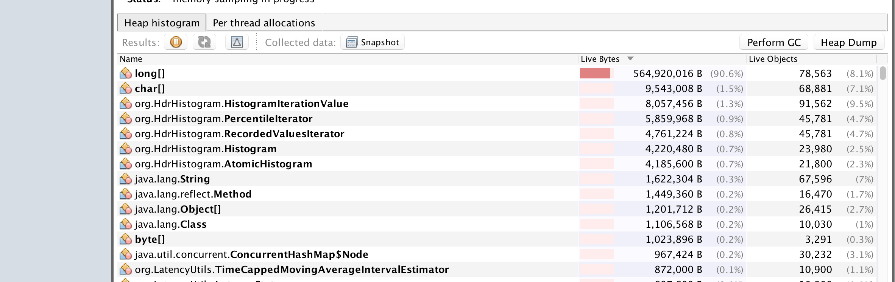
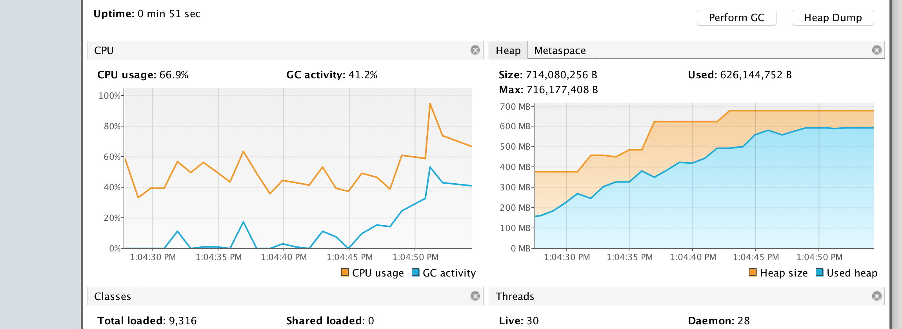
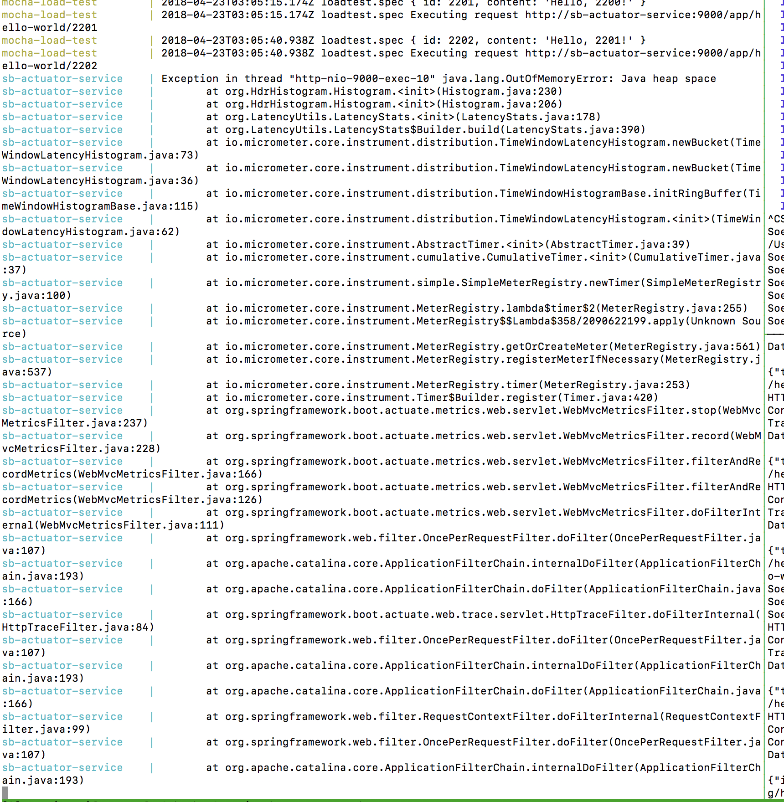

# Spring boot, Jersey, Actuator, out of memory issue

# Instructions for use

## Pre-requisites

* Docker
* npm/node
* Visual VM (for visibility into threads, overall heap usage (time-domain) and occupancy (heap sampling)

## Build the app

```
%> ./build.sh
```

## Run the app

```
%> docker-compose down && docker-compose up
```

# Observations

Once the app is running it doesn't take long to crash with the following observables

# Screenshots

Below captures the largest heap occupiers



Below captures the heap growth and GC/CPU activity over time



What we see on the console


